# 🚀 Onethinx Sprouty Workshop 🚀
## 1 Prerequisites
### 1.1 Hardware
1. Onethinx Sprouty
1. Programmer + cables + adapter PCB.

---
### 1.2 PSoC Creator
PSoC Creator is the official tool from Infineon to do the chip configuration on PSoC6
  - Download PSoC Creator [from here](https://drive.google.com/drive/folders/17IZQReRqCk6mNGf5SMYcHy2We6gLfeac?usp=share_link) or from [the official Infineon PSoC Creator page](https://www.infineon.com/cms/en/design-support/tools/sdk/psoc-software/psoc-creator/)
  - Download PDL 3.1.7 [from here](https://drive.google.com/drive/folders/17IZQReRqCk6mNGf5SMYcHy2We6gLfeac?usp=share_link) or from [the official Infineon PSoC Creator page](https://softwaretools.infineon.com/tools/com.ifx.tb.tool.psocperipheraldriverlibrarypdl)
  - Install PSoC Creator (after installation, check the bottom checkbox to continue without registration information)
  - Install PDL 3.1.7
  - Run PSoC Creator and set the freshly installed PDL by `TOOLS` -> `OPTIONS` -> `PDL v3 (PSoC6 devices) location:` -> `C:\Program Files (x86)\Cypress\PDL\3.1.7`

### 1.3 Visual Studio Code + OTX Maestro extension installation
  - Download and install the [Visual Studio Code IDE](https://code.visualstudio.com)
  - Follow the instructions in the [link to install the OTX Maestro Tools & Extension](https://github.com/onethinx/OTX-Maestro/blob/main/README.md#installation)

### 1.4 Sprouty and programming hardware
  - Make sure the programmer, adapter PCB and cable are connected to the Sprouty as shown:  
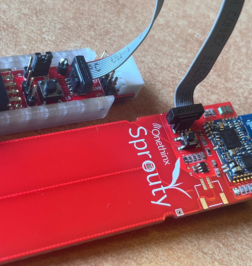 
  - **NOTE**: Do not install the battery when using the debugger.

## 2 Sprouty Project: Chip Configuration, Firmware Coding and Debugging

### 2.1 Sprouty Chip Setup / Configuration Project (uses Windows / PSoC Creator)

1. Download the Sprouty Project [from here](../assets/Sprouty_StartCode.zip)
1. After downloading, right click the .zip file and select 'Extract All'. Choose a short folder path and make sure the folder ends with `\Sprouty_StartCode` (e.g. `C:\...\Sprouty_StartCode`)
1. Open (double click) `Onethinx_Creator.cyprj` inside the project folder `..\Sprouty_StartCode\Onethinx_Creator.cydsn`. PSoC Creator will open 
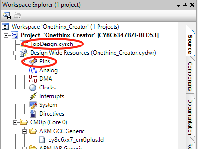 
1. Open (double click) `TopDesign.cysch` and view the internal wiring of the PSoC6, causing the LED to flash
1. Open `Pins` from the Design Wide Resources to configure the LED IO pin
1. Watch the schematic and find out the right IO pin the LED is connected with (as it's an RGB LED you may choose the color you like) 
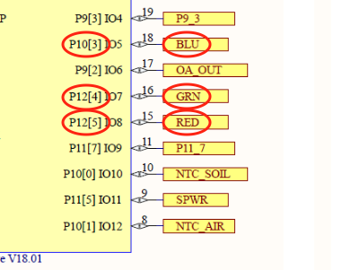 
*NOTE: the Sprouty schematic can be found [here](https://github.com/onethinx/Sprouty_Workshop/blob/main/assets/Sprouty_Datasheet_Rev_A.pdf)*
1. Click the dropdown arrow and select the IO pin we just found for the LED 
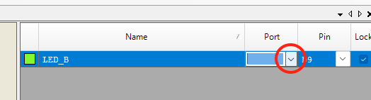 
1. Now the LED is configured for the right IO, the OTX / PSoC6 configuration project is ready to be built
1. Hit the 'Generate Application' Icon in the toolbar or select `Build >> Generate Application` 
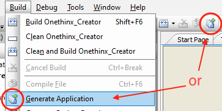 
1. Wait for PSoC Creator to generate the application files(API) 
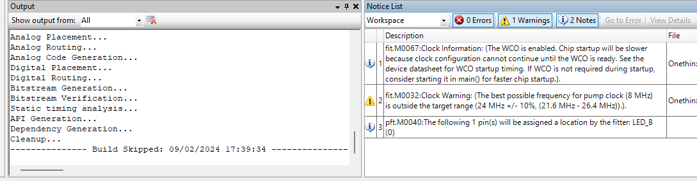 
1. The message `Build Skipped` will appear when generating the API is ready without issues
1. Chip configuration is done, PSoC Creator may now be closed.

### 2.2 Firmware Coding and Debugging (uses Visual Studio Code)

1. Start Visual Studio Code
1. Open the Sprouty folder (not the .zip file) 
To open a folder in Visual Studio Code, click on File in the top menu and select `Open Folder...` from the dropdown menu. In the file dialog that appears, navigate to the folder you want to open, select it, and click Select Folder / Open. The folder will then open in Visual Studio Code, and you will see its contents in the Explorer pane on the left side.
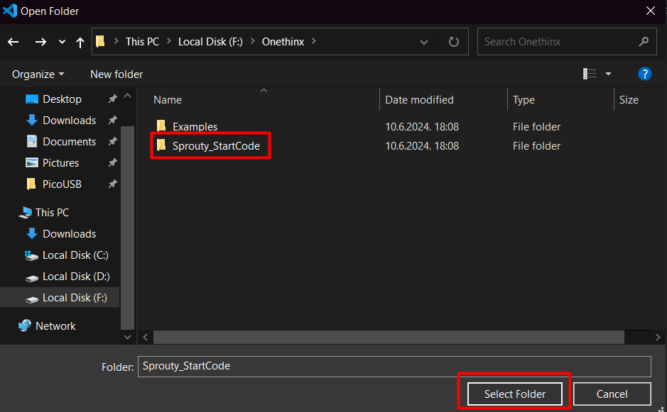 

1. As the project has not run on the PC before and as new APIs are made by PSoC Creator, the project needs to be Clean-Reconfigured before it can be built. Hit the `Clean-Reconfigure` button from the status bar at the bottom of VS Code 
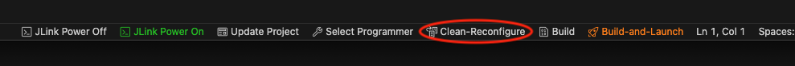

1. Press Select programmer and choose CMSIS DAP. If you have a different programmer, choose it. If you received your programmer with Sprouty, select CMSIS DAP.
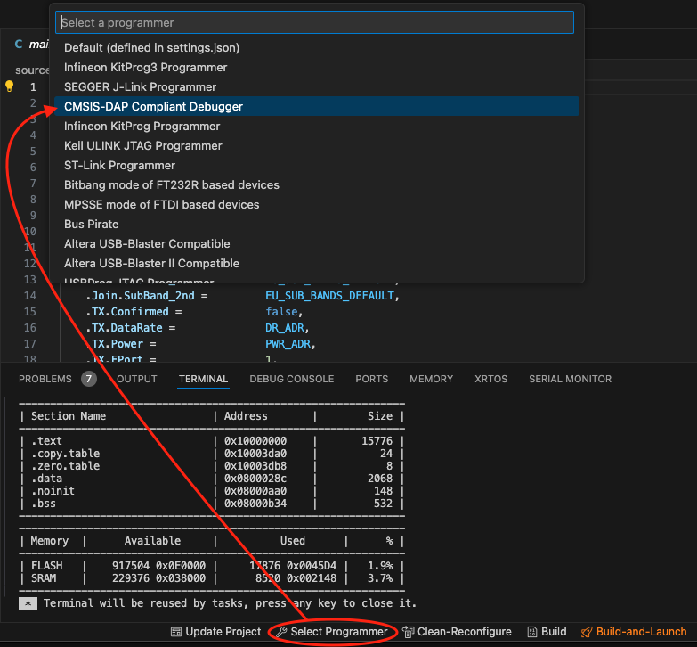

1. After successfull configuration the project can be Built and Launched from the debugger. 
  Make sure the Sprouty is connected to the debugger and PC before launching the debug session.
  Hit the `Build-And-Launch` button from the status bar at the bottom of VS Code.
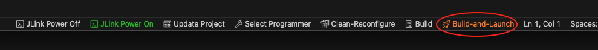 

6. Cross fingers and hopefully the firmware will be programmed, the project will enter debug mode (yellow bar) and the LED will be flashing 🎉 
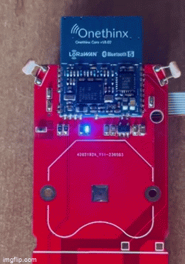 
*NOTE: your Sprouty model may differ from the one pictured* 
7. If all built and programmed well, congratulations! 🤓  You may head directly to [Part 1: Soil Temperature, Air Temperature, Light intensity and LEDs.](../Part_1_Temperatures_and_Light)  
*NOTE: if you are experiencing issues, you may contact us directly at* [our Discord channel](https://discord.gg/CvzZwXDk) 
